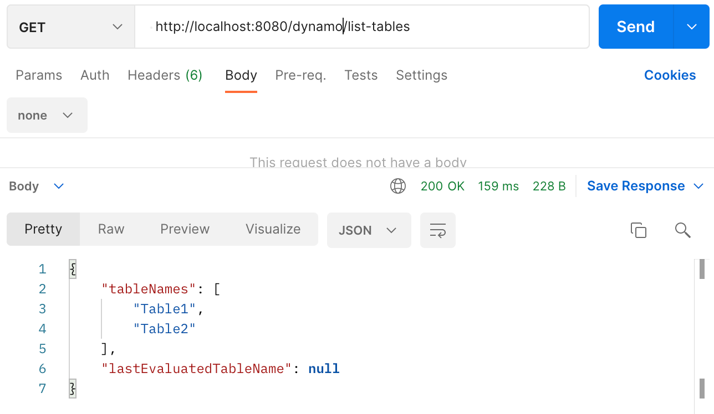
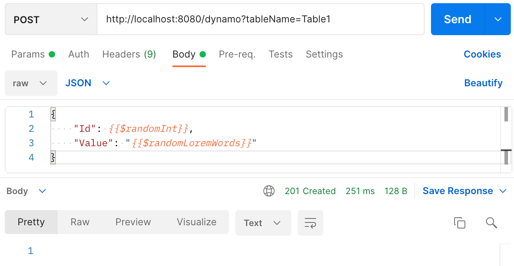
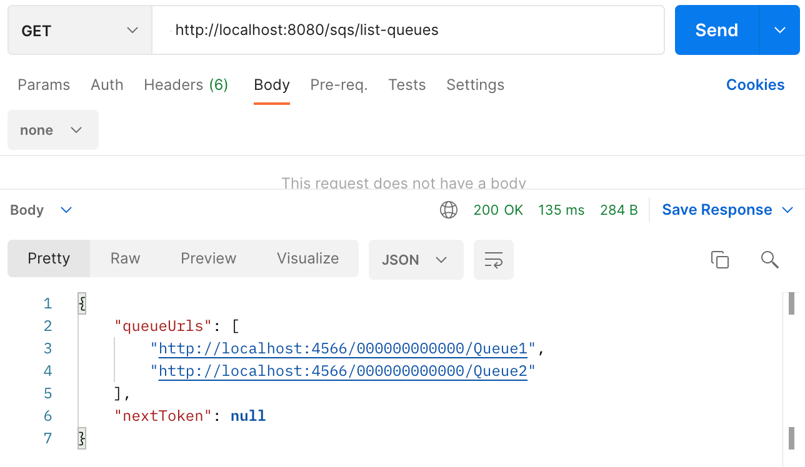
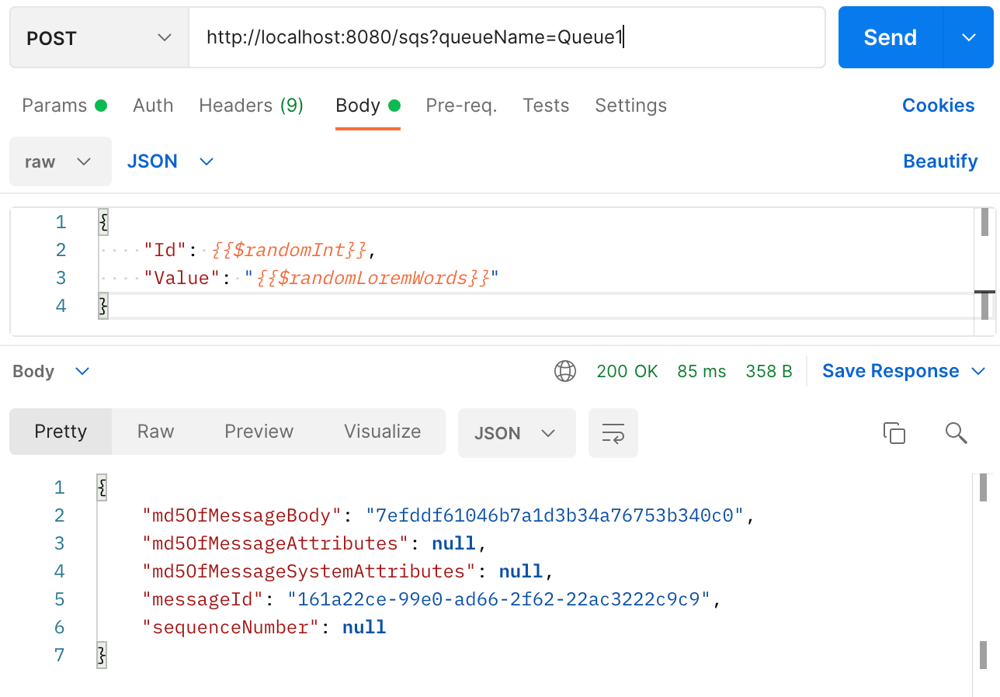
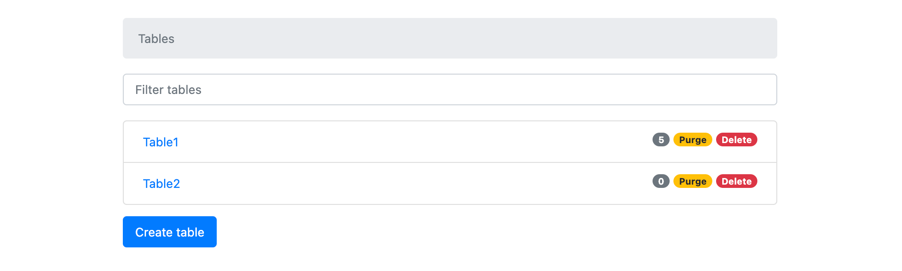
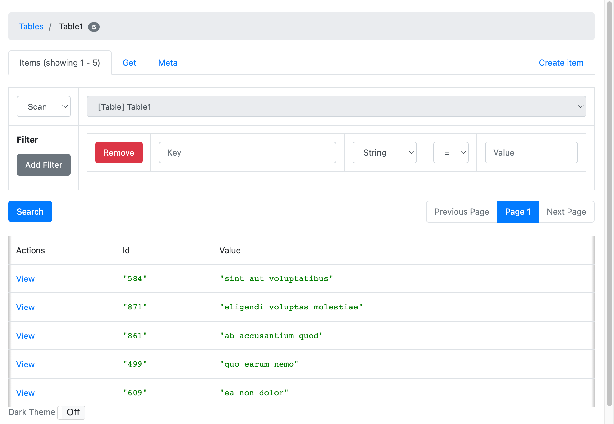
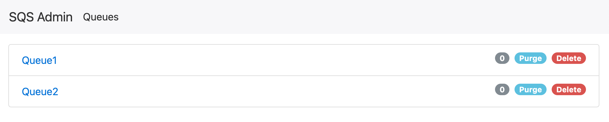
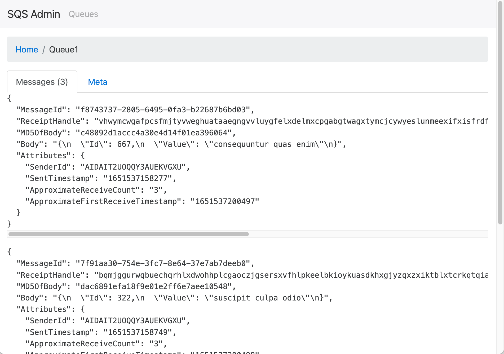

## Motivação

Projeto SpringBoot Web com Groovy/Java exemplificando como criar uma configuração com [**LocalStack**](https://github.com/localstack/localstack) coexistindo
com a configuração de "produção" que acessa a AWS real.

LocalStack é um emulador de serviços em nuvem que pode ser executado na sua máquina
fornecendo uma estrutura de teste/simulação fácil de usar para desenvolver seus aplicativos em nuvem.

Já testei: S3, SQS, SNS, Event-Bridge (events), KMS, IAM, STS.

## Tecnologias

* SpringBoot 2.6.7
* AWS 2.17.181
* Java 11
* Groovy 3.0.10
* Gradle 7.4.1

## Explicação

Necessário conhecimento prévio sobre Spring, injeção de dependência...

Temos 2 configurações para instanciar os beans dos clients AWS de acordo o desejado: real ou local e
uma configuração para criar os recursos no LocalStack.

Vamos usar a configuração do Spring *spring:profiles.include* para informar se vamos executar localmente ou não.

* [AwsConfig.groovy](src/main/groovy/io/marcusvoltolim/examples/localstack/configs/AwsConfig.groovy) - usado quando o profile é diferente de *localstack*:
  * Responsável por instanciar os beans dos clients AWS usando as credenciais informadas nas variáveis de ambiente:
    * AWS_ACCESS_KEY_ID
    * AWS_SECRET_ACCESS_KEY
* [AwsConfigLocal.groovy](src/main/groovy/io/marcusvoltolim/examples/localstack/configs/AwsConfigLocal.groovy) - Usado quando o profile é *localstack*:
  * Responsável por instanciar os beans dos clients AWS apontando para `http://localhost:4566`;
* [LocalStackConfig.groovy](src/main/groovy/io/marcusvoltolim/examples/localstack/configs/LocalStackConfig.groovy)
  * Responsável por criar os recursos no LocalStack, vamos criar 2 filas no SQS e 2 tabelas no DynamoDB.
  * Os nomes das filas e tabelas estão no [application.yaml](src/main/resources/application.yaml)

## Executando

### LocalStack - com docker-compose

* Necessário ter docker e docker-compose instalados;
* Execute o seguinte comando na raiz do projeto: `docker-compose -up`;
* Após iniciar, os recursos do LocalStack estarão disponíveis na porta: `4566` e região: `sa-east-1`
* As configurações podem ser alteradas no arquivo [docker-compose.yaml](docker-compose.yaml), além de (des)ativar os serviços desejados.

### Aplicação

* Existem diversas maneiras de iniciar uma aplicação SpringBoot;
* Pode usar sua IDE de preferência (eu uso IntelliJ);
* Ou executar o seguinte comando na raiz do projeto: `./gradlew bootRun`
* Independente de como executar, em caso de sucesso terá o log: *Tomcat started on port(s): 8080 (http) with context path ''*,
  informando que a aplicação (endpoints) está sendo exposta na porta: *8080*.
### Endpoints

#### DynamoDb

No [DynamoDbController](src/main/groovy/io/marcusvoltolim/examples/localstack/controllers/DynamoDbController.groovy) temos 2 endpoints:

* Listar todas as tabelas:
  ```
  curl --location --request GET 'http://localhost:8080/dynamo/list-tables'
  ```
  

* Inserir um item (json) na tabela:
  ```
  curl --location --request POST 'http://localhost:8080/dynamo?tableName=Table1' \
  --header 'Content-Type: application/json' \
  --data-raw '{
     "Id": 935,
     "Value": "content"
  }'
  ```
  

---

#### SQS

No [SqsController](src/main/groovy/io/marcusvoltolim/examples/localstack/controllers/SqsController.groovy) temos 2 endpoints:

* Listar todas as filas:
  ```
  curl --location --request GET 'http://localhost:8080/sqs/list-queues'
  ```
  

* Postar uma mensagem (json) na fila:
  ```
  curl --location --request POST 'http://localhost:8080/sqs?queueName=Queue1' \
  --header 'Content-Type: application/json' \
  --data-raw '{
     "Id": 935,
     "Value": "content"
  }'
  ```
  

### Validando

Podemos usar as aplicações abaixo, que são interfaces visuais para **DynamoDb** e **SQS** para verificar se os recursos foram criados localmente.

Instalando (necesário ter node/npm já instalado):

* `npm install dynamodb-admin -g`
* `npm install sqs-admin -g`

Executando via terminal (macOS):

* `DYNAMO_ENDPOINT=http://localhost:4566 AWS_REGION=sa-east-1 dynamodb-admin --open &`
* `SQS_ENDPOINT=http://localhost:4566 AWS_REGION=sa-east-1 sqs-admin & open http://localhost:8002 &`

Após executar podemos verificar e manipular os recursos criados no navegador:


---

---

---


Para mais detalhes segue os respectivos repositórios dos projetos:

* [dynamodb-admin](https://github.com/aaronshaf/dynamodb-admin)
* [sqs-admin](https://github.com/aaronshaf/sqs-admin)
